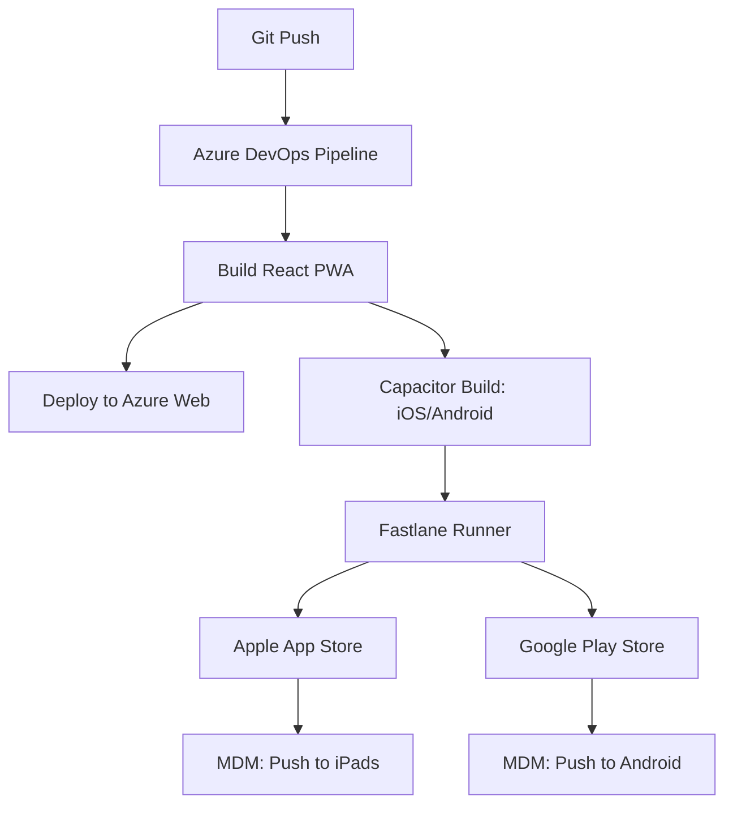

# Deployment Automation Guide: App Store, Play Store & MDM

This guide provides technical instructions for automating the deployment of the JA BizTown unified codebase (PWA) to mobile stores and MDM platforms using Fastlane and Azure DevOps.

---

## 1. Automation Architecture

The automation follows a **"Single Codebase, Multiple Targets"** strategy.



---

## 2. Fastlane Setup

Fastlane is the industry standard for automating store deployments. We use it to handle screenshots, certificates, and binary uploads.

### Initializing Fastlane
Run within the `ios/` and `android/` directories generated by Capacitor:
```bash
fastlane init
```

### iOS `Fastfile` (Snippet)
```ruby
lane :pilot do
  get_certificates           # Match / Cert
  get_provisioning_profile    # Match / PP
  increment_build_number
  build_app(scheme: "App")
  upload_to_testflight        # Upload to App Store Connect
end

lane :release do
  build_app(scheme: "App")
  upload_to_app_store(submit_for_review: true)
end
```

### Android `Fastfile` (Snippet)
```ruby
lane :pilot do
  increment_version_code
  gradle(task: "bundle", build_type: "Release")
  upload_to_play_store(track: "internal")
end

lane :release do
  upload_to_play_store(track: "production")
end
```

---

## 3. Azure DevOps Pipeline Integration

JA USA manages the Azure DevOps project. The vendor will configure the YAML pipelines.

### `azure-pipelines.yml` (Mobile Stage)
```yaml
stages:
- stage: Build_Mobile
  jobs:
  - job: iOS_Build
    pool:
      vmImage: 'macOS-latest'
    steps:
    - task: InstallAppleCertificate@2
      inputs:
        certSecureFile: 'production.p12'
    - script: |
        npm install
        npx cap copy ios
        cd ios && fastlane pilot
      env:
        FASTLANE_PASSWORD: $(APPLE_ID_PASSWORD)
  
  - job: Android_Build
    pool:
      vmImage: 'ubuntu-latest'
    steps:
    - task: DownloadSecureFile@1
      inputs:
        secureFile: 'google-play-key.json'
    - script: |
        npm install
        npx cap copy android
        cd android && fastlane pilot
      env:
        SUPPLY_JSON_KEY: $(GOOGLE_PLAY_KEY_PATH)
```

---

## 4. MDM (Mobile Device Management) Automation

JA Areas use varied MDM solutions (Jamf, Intune, etc.). Silent app distribution is achieved via "Managed App" or "VPP" (Volume Purchase Program) pathways.

### Apple VPP (Volume Purchase Program)
1. **Purchase**: JA USA "purchases" free licenses of the app in Apple Business Manager.
2. **Sync**: The MDM (e.g., Jamf) syncs with Apple Business Manager.
3. **Assign**: The MDM assigns the app to Area-specific device groups.
4. **Push**: The MDM pushes the app silently to all enrolled tablets. **No Apple ID required on the device.**

### Managed Google Play
1. **Approve**: Approve the app in the Managed Google Play store.
2. **Assign**: Assign to the Android Enterprise device group in the MDM (e.g., Microsoft Intune).
3. **Force Install**: Set the installation type to "Required" for silent push.

---

## 5. Security & Secret Management

> [!CAUTION]
> Never commit `.p12` certificates or `json` keys to the repository.

1. **Azure DevOps Secure Files**: Upload all certificates and keystores here.
2. **Variable Groups**: Store passwords and API keys (e.g., `FASTLANE_PASSWORD`, `MATCH_PASSWORD`) as secret variables in Azure DevOps.
3. **App Store Connect API**: Use API Keys instead of individual Apple ID logins for more reliable CI performance.

---

## 6. Verification Steps for DevOps Team
1. **Validate Bundles**: Ensure the `bundle_id` matches exactly across Apple Business Manager and the MDM.
2. **Connection Check**: Verify the Azure DevOps Service Connection to the App Store and Google Play Console.
3. **Pilot Sign-off**: Before any MDM push, ensure the `pilot` lane has successfully updated TestFlight/Internal Testing.
